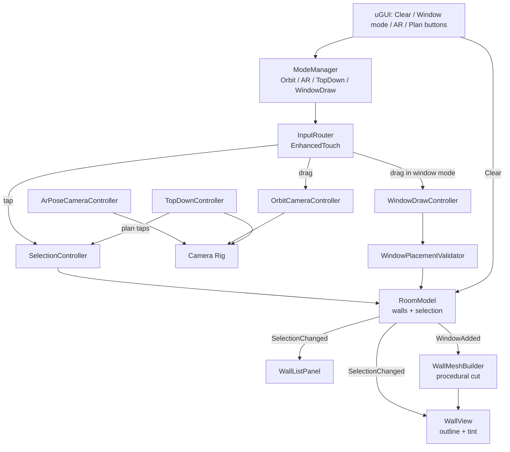

# Room Wall Selection Design

**Spec**: `.specs/features/room-wall-selection/spec.md`
**Status**: Draft

---

## Architecture Overview

Light MVC/MVP (user-locked): a plain-C# domain layer (models + services, no UnityEngine dependency where possible) exposes state and C# `event Action` notifications; MonoBehaviour presenters/views subscribe and render. Input flows one way: InputRouter → controllers → domain; domain events flow back → views/UI.



---

## Code Reuse Analysis

### Existing Components to Leverage

Greenfield repository (docs only — no code exists yet). Reuse is therefore package-level, not code-level.

| Component | Location | How to Use |
| --------- | -------- | ---------- |
| URP + RenderObjects Renderer Feature | `com.unity.render-pipelines.universal` (17.x, ships with Unity 6) | Renders selected-wall layer with outline pass |
| Input System + EnhancedTouch | `com.unity.inputsystem` (verified via Package Manager for 6000.x) | Touch/tap/drag; Editor mouse simulation via Input System's touch simulation |
| AR Foundation + ARKit XR Plugin + XR Simulation | `com.unity.xr.arfoundation@6.x`, `com.unity.xr.arkit@6.x` (6.4.3 verified for Unity 6000.4) | Device-pose tracking for AR mode; XR Simulation validates in Editor |
| uGUI + TextMeshPro | `com.unity.ugui` | List panel, buttons |
| Unity Test Framework | `com.unity.test-framework` | EditMode + PlayMode suites |

### Integration Points

| System | Integration Method |
| ------ | ------------------ |
| URP renderer asset | Add RenderObjects feature filtered to `SelectedWall` layer with outline material |
| XR Plug-in Management | Enable ARKit provider (iOS) + XR Simulation (Editor) |
| EventSystem (uGUI) | `IsPointerOverGameObject` gate before scene raycasts (SEL-03, edge cases) |

---

## Components

### RoomModel (domain, plain C#)

- **Purpose**: Single source of truth: wall definitions, selection set, windows per wall; raises change events.
- **Location**: `Assets/Scripts/Domain/RoomModel.cs`
- **Interfaces**:
  - `IReadOnlyList<Wall> Walls`
  - `bool IsSelected(int wallId)` / `void ToggleSelection(int wallId)` / `void ClearSelection()`
  - `bool TryAddWindow(int wallId, Rect2D rect, out WindowRejection reason)`
  - `event Action<int, bool> SelectionChanged` / `event Action ClearedAll` / `event Action<int, WindowSpec> WindowAdded`
- **Dependencies**: WindowPlacementValidator
- **Reuses**: none (greenfield)

### RoomBuilder (domain + scene bootstrap)

- **Purpose**: Generates the room from an ordered footprint polygon (N >= 3 vertices): wall definitions + floor/ceiling meshes; instantiates WallViews. Rectangular 4-wall footprint in the shipped scene; algorithm generic for N (ROOM-01).
- **Location**: `Assets/Scripts/Domain/RoomBuilder.cs`, `Assets/Scripts/Presentation/RoomBootstrap.cs`
- **Interfaces**: `static RoomDefinition Build(IReadOnlyList<Vector2> footprint, float height)`
- **Dependencies**: WallMeshBuilder
- **Reuses**: none

### WallMeshBuilder (domain, plain C#)

- **Purpose**: Builds a wall mesh (double-sided quad prism) with zero or more axis-aligned rectangular holes — real cut, see-through (WIN-02).
- **Location**: `Assets/Scripts/Domain/WallMeshBuilder.cs`
- **Interfaces**: `static MeshData Build(WallDefinition wall, IReadOnlyList<Rect2D> holes)`
- **Algorithm**: wall face treated in wall-local 2D; holes are axis-aligned and non-overlapping, so the face decomposes into rectangles by grid slicing: collect X cuts and Y cuts from hole edges, tile the face, emit tiles not inside a hole. O(n²) tiles for n windows — fine at this scale. Returns raw arrays (`MeshData`) so it is Editor-testable without UnityEngine mesh objects.
- **Dependencies**: none
- **Reuses**: none

### WindowPlacementValidator (domain, plain C#)

- **Purpose**: Clamp rect to wall bounds; reject overlap with existing windows; reject below minimum size (WIN-03).
- **Location**: `Assets/Scripts/Domain/WindowPlacementValidator.cs`
- **Interfaces**: `ValidationResult Validate(WallDefinition wall, IReadOnlyList<Rect2D> existing, Rect2D candidate)` → clamped rect or rejection reason
- **Dependencies**: none
- **Reuses**: none

### InputRouter (presentation)

- **Purpose**: Single EnhancedTouch entry point; classifies tap vs drag (threshold: 20 px DPI-scaled / 300 ms, tunable); dispatches to the active mode's controller; gates on `EventSystem.IsPointerOverGameObject` (SEL-03).
- **Location**: `Assets/Scripts/Presentation/InputRouter.cs`
- **Interfaces**: `event Action<Vector2> Tapped` / `event Action<Vector2> DragDelta` / `event Action<Vector2> DragStart/DragEnd`
- **Dependencies**: Input System (EnhancedTouch + touch simulation in Editor), ModeManager
- **Reuses**: none

### SelectionController (presentation)

- **Purpose**: Raycasts taps; wall hit → `ToggleSelection`; empty-space hit → `ClearSelection` (CLR-02); floor/ceiling hit → no-op (SEL-03).
- **Location**: `Assets/Scripts/Presentation/SelectionController.cs`
- **Interfaces**: `void OnTap(Vector2 screenPos)`
- **Dependencies**: RoomModel, Physics.Raycast, camera
- **Reuses**: InputRouter events

### OrbitCameraController (presentation)

- **Purpose**: First-person yaw 360 deg free / pitch clamped (-60..+60 default, serialized), driven by drag deltas; no zoom (CAM-01/02).
- **Location**: `Assets/Scripts/Presentation/OrbitCameraController.cs`
- **Interfaces**: `void OnDrag(Vector2 delta)`; `void SetRotation(float yaw, float pitch)` (for AR→touch handoff)
- **Dependencies**: camera rig transform
- **Reuses**: InputRouter events

### ArPoseCameraController (presentation)

- **Purpose**: When AR mode is on, drives the camera rig from AR Foundation device pose (TrackedPoseDriver / XROrigin); on exit hands the current orientation back to OrbitCameraController (AR-01).
- **Location**: `Assets/Scripts/Presentation/ArPoseCameraController.cs`
- **Dependencies**: AR Foundation (ARSession, XROrigin), ModeManager
- **Reuses**: XR Simulation in Editor

### WallView (presentation)

- **Purpose**: Per-wall MeshFilter/MeshRenderer/MeshCollider; applies outline + tint on selection (layer swap to `SelectedWall` + material property block); rebuilds mesh on WindowAdded.
- **Location**: `Assets/Scripts/Presentation/WallView.cs`
- **Dependencies**: RoomModel events, WallMeshBuilder output, URP outline feature
- **Reuses**: none

### WindowDrawController (presentation)

- **Purpose**: In window mode: DragStart raycast fixes the target wall + first corner; drag updates a preview quad in wall space (clamped live); DragEnd validates via RoomModel.TryAddWindow; rejection removes preview (WIN-01/03).
- **Location**: `Assets/Scripts/Presentation/WindowDrawController.cs`
- **Dependencies**: RoomModel, InputRouter, per-wall plane projection
- **Reuses**: WindowPlacementValidator via model

### WallListPanel (presentation/UI)

- **Purpose**: Collapsible uGUI panel; one row per wall (name + state); subscribes to SelectionChanged/ClearedAll; rows update even while collapsed (LIST-01/02).
- **Location**: `Assets/Scripts/UI/WallListPanel.cs`
- **Dependencies**: RoomModel events, uGUI/TMP
- **Reuses**: none

### TopDownController (presentation)

- **Purpose**: Toggles an orthographic top camera; forwards plan taps to SelectionController's raycast path; restores previous 3D camera state on exit (TOP-01/02).
- **Location**: `Assets/Scripts/Presentation/TopDownController.cs`
- **Dependencies**: camera rig, ModeManager, SelectionController
- **Reuses**: same tint pipeline as 3D (WallView materials visible from above)

### ModeManager (presentation)

- **Purpose**: Explicit state machine: `Orbit | WindowDraw | Ar | TopDown`; owns valid transitions and toggles input routing + controller enablement.
- **Location**: `Assets/Scripts/Presentation/ModeManager.cs`
- **Interfaces**: `Mode Current`, `bool TrySet(Mode m)`, `event Action<Mode> ModeChanged`
- **Dependencies**: none (others depend on it)

---

## Data Models

```csharp
struct Rect2D { float x, y, w, h; }          // wall-local meters, origin bottom-left
class WallDefinition { int id; string name; Vector3 origin; Vector3 right; Vector3 up; float width; float height; }
class WindowSpec { int wallId; Rect2D rect; }
class RoomDefinition { List<WallDefinition> walls; MeshData floor; MeshData ceiling; }
class MeshData { Vector3[] vertices; int[] triangles; Vector2[] uvs; }
enum WindowRejection { None, Overlap, TooSmall, OutOfBounds, InvalidWall }
enum Mode { Orbit, WindowDraw, Ar, TopDown }
```

**Relationships**: RoomModel owns walls + selection set (`HashSet<int>`) + `Dictionary<int, List<WindowSpec>>`. Views never mutate state directly; all mutation goes through RoomModel methods.

---

## Error Handling Strategy

| Error Scenario | Handling | User Impact |
| -------------- | -------- | ----------- |
| Window rect overlaps / too small / out of bounds | `TryAddWindow` returns rejection; preview destroyed | Preview disappears; wall unchanged (brief red preview flash optional) |
| Mesh rebuild yields degenerate geometry | Builder validates output (non-empty, finite verts); on failure model rolls back the window entry | Previous wall stays; window rejected |
| AR tracking unavailable / session fails | AR toggle disabled (WHERE-gated); fallback to orbit | Button greyed out, orbit keeps working |
| Tap over uGUI element | `IsPointerOverGameObject` short-circuits raycast | UI press never selects/clears walls |
| Multi-touch during drag | Only primary touch processed | No camera jump or ghost taps |

---

## Risks & Concerns

| Concern | Location (file:line) | Impact | Mitigation |
| ------- | -------------------- | ------ | ---------- |
| Greenfield repo — no code to flag | n/a | n/a | None found — is a valid entry |
| Outline on large flat walls: inverted-hull looks wrong on thin prisms | design decision | Ugly selection feedback | Use URP RenderObjects layer pass (screen-space outline over `SelectedWall` layer), not inverted hull; tint via MaterialPropertyBlock as guaranteed-visible fallback |
| EnhancedTouch has no native mouse events in Editor | InputRouter | Editor validation (chosen target) breaks | Enable Input System touch simulation (`TouchSimulation.Enable()`) in Editor; PlayMode tests use Input System's `InputTestFixture` |
| AR pose position can walk the camera through walls | ArPoseCameraController | Camera exits room in AR mode | Drive rotation from pose always; position clamped to room interior bounds |

---

## Tech Decisions (only non-obvious ones)

| Decision | Choice | Rationale |
| -------- | ------ | --------- |
| Outline technique | URP RenderObjects Renderer Feature over `SelectedWall` layer + tint via MaterialPropertyBlock | Per-object screen-space outline reads clean on flat walls; no per-mesh shell mesh; tint is trivial and always visible |
| Hole cutting | Rect grid-slicing decomposition (axis-aligned holes on rectangular face) | Exact, allocation-light, unit-testable pure function; avoids general CSG/ear-clipping dependency |
| Domain/Unity split | Domain = plain C# with own `Rect2D`/`MeshData` types | EditMode tests run without scene; mesh math testable as arrays |
| Tap vs drag | Threshold in InputRouter only (20 px DPI-scaled / 300 ms) | One place to tune; controllers never re-classify |
| Mode handling | Explicit ModeManager state machine | Four modes with exclusive input claims; implicit flags would leak transitions |
| AR camera handoff | On AR exit, copy pose yaw/pitch into OrbitCameraController | Prevents camera snap (AR-01 AC3) |

> Project-level: architecture pattern, stack and language recorded as AD-001..AD-004 in `.specs/STATE.md`.
