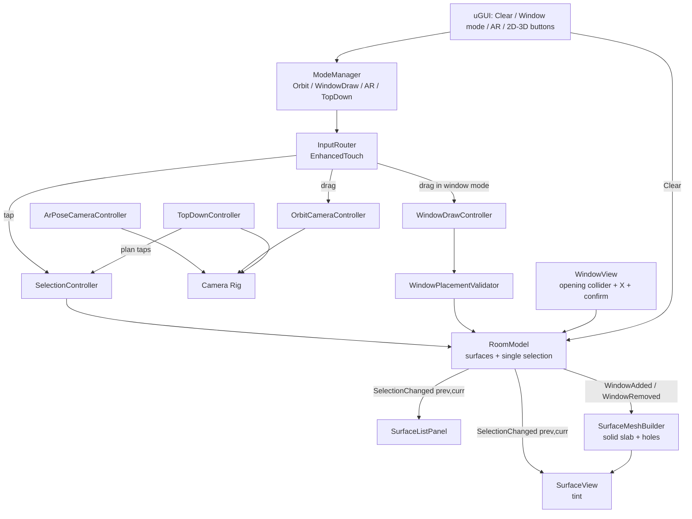

# Room Wall Selection Design

**Spec**: `.specs/features/room-wall-selection/spec.md`
**Status**: Draft (revised 2026-08-17 per user revision request — single selection, Surface concept, thickness, deletion, 2D/3D, P0 bootstrap)

---

## Architecture Overview

Light MVC/MVP (user-locked): a plain-C# domain layer (models + services, no UnityEngine dependency where possible) exposes state and C# `event Action` notifications; MonoBehaviour presenters/views subscribe and render. Input flows one way: InputRouter → controllers → domain; domain events flow back → views/UI.



---

## Code Reuse Analysis

### Existing Components to Leverage

Greenfield repository (docs only — no code exists yet). Reuse is therefore package-level, not code-level.

| Component | Location | How to Use |
| --------- | -------- | ---------- |
| URP + RenderObjects Renderer Feature | `com.unity.render-pipelines.universal` (17.x, ships with Unity 6) | Stencil two-pass outline over `SelectedSurface` layer (P2 polish, OUT-01) |
| Input System + EnhancedTouch | `com.unity.inputsystem` (verified via Package Manager for 6000.x) | Touch/tap/drag; Editor mouse simulation via Input System's touch simulation |
| AR Foundation + ARKit XR Plugin + XR Simulation | `com.unity.xr.arfoundation@6.x`, `com.unity.xr.arkit@6.x` (6.4.3 verified for Unity 6000.4) | Device-pose tracking for AR mode; XR Simulation validates in Editor |
| uGUI + TextMeshPro | `com.unity.ugui` | List panel, buttons, confirmation popup |
| Unity Test Framework | `com.unity.test-framework` | EditMode + PlayMode suites |

### Integration Points

| System | Integration Method |
| ------ | ------------------ |
| URP renderer asset | Two RenderObjects features for the P2 outline: (1) `SelectedSurface` layer writes stencil ref; (2) edge material pass draws where stencil differs. A single RenderObjects pass alone does NOT produce an outline — it only re-renders the layer |
| XR Plug-in Management | Enable ARKit provider (iOS) + XR Simulation (Editor) |
| EventSystem (uGUI) | `IsPointerOverGameObject` gate before scene raycasts (SEL-03, EDGE-02) |
| Unity MCP | P0 bootstrap Editor operations; fallback per AD-006 (agent writes text assets, human verifies in Editor) |

---

## Components

### RoomModel (domain, plain C#)

- **Purpose**: Single source of truth: surface definitions, the single selection, windows per wall; raises change events.
- **Location**: `Assets/Scripts/Domain/RoomModel.cs`
- **Interfaces**:
  - `IReadOnlyList<SurfaceDefinition> Surfaces`
  - `int? SelectedSurfaceId { get; }`
  - `void Select(int surfaceId)` — selects `surfaceId`, deselecting the previous one. Selecting the already-selected surface is a no-op (no event). Raises `SelectionChanged(previous, current)` otherwise.
  - `void ClearSelection()` — idempotent: if nothing is selected, no state changes and no event is raised. Otherwise raises `SelectionChanged(previous, null)`.
  - `bool TryAddWindow(int surfaceId, Rect2D rect, out WindowRejection reason)` — rejects non-Wall surfaces with `InvalidSurfaceKind`.
  - `bool TryRemoveWindow(int windowId)`
  - `event Action<int?, int?> SelectionChanged` — carries (previous, current) so views update both rows/tints in one call. No separate ClearedAll event: clear is `SelectionChanged(previous, null)`.
  - `event Action<WindowSpec> WindowAdded` / `event Action<WindowSpec> WindowRemoved`
- **Dependencies**: WindowPlacementValidator
- **Reuses**: none (greenfield)

### RoomBuilder (domain + scene bootstrap)

- **Purpose**: Generates the room from an ordered footprint polygon (N >= 3 vertices): N wall surfaces plus floor and ceiling surfaces, all solid slabs; instantiates SurfaceViews. Rectangular 4-wall footprint in the shipped scene; algorithm generic for N (ROOM-01).
- **Location**: `Assets/Scripts/Domain/RoomBuilder.cs`, `Assets/Scripts/Presentation/RoomBootstrap.cs`
- **Interfaces**: `static RoomDefinition Build(IReadOnlyList<Vector2> footprint, float height, float thickness)`
- **Dependencies**: SurfaceMeshBuilder
- **Reuses**: none

### SurfaceMeshBuilder (domain, plain C#)

- **Purpose**: Builds a solid slab mesh for a surface (thickness 0.15 m default) with zero or more axis-aligned rectangular through-holes — real cut, see-through, with reveal faces (WIN-02).
- **Location**: `Assets/Scripts/Domain/SurfaceMeshBuilder.cs`
- **Interfaces**: `static MeshData Build(SurfaceDefinition surface, IReadOnlyList<Rect2D> holes)`
- **Algorithm** (solid, not a double-sided quad): the surface is a slab extruded along `-normal` by `thickness`. In surface-local 2D:
  1. **Front face**: holes are axis-aligned and non-overlapping, so the face decomposes exactly into rectangles by grid slicing — collect X cuts and Y cuts from hole edges, tile the face, emit tiles not inside a hole.
  2. **Back face**: same tile layout offset by `-thickness` along the normal, winding reversed.
  3. **Outer slab sides**: 4 border quads (top/bottom/left/right of the slab).
  4. **Reveal faces**: per hole, 4 quads connecting the front hole edges to the back hole edges (left/right/top/bottom of the opening), normals facing into the opening — these are what make the cut read as a real wall opening.
  O(n²) tiles for n windows — fine at this scale. Returns raw arrays (`MeshData`) so it is EditMode-testable without UnityEngine mesh objects. Output validation: non-empty, finite vertices; failure → caller keeps previous mesh (EDGE-05).
- **Dependencies**: none
- **Reuses**: none

### WindowPlacementValidator (domain, plain C#)

- **Purpose**: All placement rules (WIN-03): clamp rect to wall bounds minus edge margin; reject overlap with existing windows; reject below minimum size (0.2 m) or above maximum size (2.0 m default); reject margin violation (< 0.1 m from any wall edge); reject non-Wall surface kinds.
- **Location**: `Assets/Scripts/Domain/WindowPlacementValidator.cs`
- **Interfaces**: `ValidationResult Validate(SurfaceDefinition surface, IReadOnlyList<Rect2D> existing, Rect2D candidate)` → clamped rect or rejection reason
- **Dependencies**: none
- **Reuses**: none

### InputRouter (presentation)

- **Purpose**: Single EnhancedTouch entry point; classifies tap vs drag (threshold: 20 px DPI-scaled / 300 ms, tunable); dispatches to the active mode's controller; gates on `EventSystem.IsPointerOverGameObject` (SEL-03, EDGE-02); primary touch only (EDGE-01).
- **Location**: `Assets/Scripts/Presentation/InputRouter.cs`
- **Interfaces**: `event Action<Vector2> Tapped` / `event Action<Vector2> DragDelta` / `event Action<Vector2> DragStart/DragEnd`
- **Dependencies**: Input System (EnhancedTouch + touch simulation in Editor), ModeManager
- **Reuses**: none

### SelectionController (presentation)

- **Purpose**: Raycasts taps. Surface hit (wall, floor or ceiling) → `RoomModel.Select(id)` — any valid surface hit moves the selection (SEL-01). Miss (empty space, or ray through a window opening) → selection unchanged (SEL-03). A hit whose collider carries a `WindowView` component (component check, no dedicated layer) is NOT a surface hit: the tap routes to that WindowView (shows the X) and never changes the selection (SEL-03 AC7). While ModeManager is in WindowDraw, taps are not dispatched to selection at all — the target wall is locked (WIN-01 AC13). In 2D mode a Floor hit within the screen-space tolerance (30 px default, serialized) of a wall selects the nearest such wall instead (TOP-02 AC8). There is no tap-to-clear path. Raycast layer mask includes BOTH the default surface layer and `SelectedSurface` — required once the P2 outline layer swap exists, otherwise the selected surface becomes unhittable (OUT-01).
- **Location**: `Assets/Scripts/Presentation/SelectionController.cs`
- **Interfaces**: `void OnTap(Vector2 screenPos)`
- **Dependencies**: RoomModel, Physics.Raycast, camera
- **Reuses**: InputRouter events

### OrbitCameraController (presentation)

- **Purpose**: First-person yaw 360 deg free / pitch clamped (-60..+60 default, serialized), driven by drag deltas; no zoom; camera at the room centre at 1.6 m eye height (serialized), position kept inside the room while in Orbit mode (CAM-01/02).
- **Location**: `Assets/Scripts/Presentation/OrbitCameraController.cs`
- **Interfaces**: `void OnDrag(Vector2 delta)`; `void SetRotation(float yaw, float pitch)` (for AR→touch handoff); `void ResetToRoomCentre()` (for TopDown→3D return)
- **Dependencies**: camera rig transform
- **Reuses**: InputRouter events

### ArPoseCameraController (presentation)

- **Purpose**: When AR mode is on, drives the camera rig from AR Foundation device pose (TrackedPoseDriver / XROrigin); rotation always from pose, position clamped to room interior; on exit hands the current orientation back to OrbitCameraController (AR-01).
- **Location**: `Assets/Scripts/Presentation/ArPoseCameraController.cs`
- **Dependencies**: AR Foundation (ARSession, XROrigin), ModeManager
- **Reuses**: XR Simulation in Editor

### SurfaceView (presentation)

- **Purpose**: Per-surface MeshFilter/MeshRenderer/MeshCollider. Selection tint via MaterialPropertyBlock (SEL-02); P2 adds layer swap to `SelectedSurface` for the outline pass (OUT-01). Rebuilds on WindowAdded/WindowRemoved: builds the Mesh from `MeshData` AND assigns it to the MeshCollider (`sharedMesh = null; sharedMesh = newMesh`) in the same operation — never renderer-only (WIN-02 AC5/AC12).
- **Location**: `Assets/Scripts/Presentation/SurfaceView.cs`
- **Dependencies**: RoomModel events, SurfaceMeshBuilder output, URP outline feature (P2)
- **Reuses**: none

### WindowDrawController (presentation)

- **Purpose**: In window mode: DragStart raycast fixes the target wall + first corner; drag updates a preview quad in wall space (clamped live to bounds minus margin); DragEnd validates via `RoomModel.TryAddWindow`; rejection removes preview (WIN-01/03). Cancelled (preview destroyed, no window) when the mode exits mid-drag — Clear button, 2D button, or mode change (CLR-01 AC3, TOP-02).
- **Location**: `Assets/Scripts/Presentation/WindowDrawController.cs`
- **Dependencies**: RoomModel, InputRouter, per-wall plane projection
- **Reuses**: WindowPlacementValidator via model

### WindowView (presentation)

- **Purpose**: Per-window GameObject: a BoxCollider sized to the opening (rect x thickness) so the opening is tappable (WIN-04 AC1). Identified by its `WindowView` component at raycast time (SelectionController inspects the hit — no dedicated layer), so a window hit never counts as a surface hit. Tap → shows an "X" button anchored to the opening's top-right (world-anchored uGUI). X → confirmation popup; confirm → `RoomModel.TryRemoveWindow(id)`; cancel → close popup, no change. Created on WindowAdded, destroyed on WindowRemoved.
- **Location**: `Assets/Scripts/Presentation/WindowView.cs`
- **Dependencies**: RoomModel, uGUI popup prefab
- **Reuses**: none

### SurfaceListPanel (presentation/UI)

- **Purpose**: Collapsible uGUI panel; one row per surface — walls, floor, ceiling — (name + state); subscribes to `SelectionChanged(previous, current)` and updates exactly the two affected rows in one handler call; rows update even while collapsed (LIST-01/02, EDGE-06).
- **Location**: `Assets/Scripts/UI/SurfaceListPanel.cs`
- **Dependencies**: RoomModel events, uGUI/TMP
- **Reuses**: none

### TopDownController (presentation)

- **Purpose**: Handles the "2D | 3D" buttons (TOP-01/02). Entering 2D: switches to an orthographic top camera framed fit-to-room (orthographic size = room bounds + small margin; never further out, so the plan stays legible), disables the ceiling SurfaceView's MeshRenderer AND MeshCollider (collider left on would invisibly block every plan tap), clears the selection and cancels any in-progress window draw. While in 2D: plan taps go through SelectionController (single-selection rules, with the 30 px wall-tap tolerance — walls are ~0.15 m edge-on in plan, untappable without it); pinch zoom scales orthographic size within 0.5x–2.0x of fit-to-room (serialized limits); pinch does nothing in 3D. Entering 3D: restores ceiling renderer + collider, returns to Orbit mode with the camera at the room centre.
- **Location**: `Assets/Scripts/Presentation/TopDownController.cs`
- **Dependencies**: camera rig, ModeManager, SelectionController, ceiling SurfaceView
- **Reuses**: same tint pipeline as 3D

### ModeManager (presentation)

- **Purpose**: Explicit state machine: `Orbit | WindowDraw | Ar | TopDown`; owns valid transitions and toggles input routing + controller enablement.
- **Location**: `Assets/Scripts/Presentation/ModeManager.cs`
- **Interfaces**: `Mode Current`, `bool TrySet(Mode m)`, `event Action<Mode, Mode> ModeChanged`
- **Transition matrix** (`TrySet` returns false on illegal transitions; side effects listed run on the transition):

| From \ To | Orbit | WindowDraw | Ar | TopDown |
| --------- | ----- | ---------- | -- | ------- |
| **Orbit** | — | Legal only if selected surface is a Wall (button hidden otherwise, WIN-01) | Legal (starts AR session) | Legal; clears selection |
| **WindowDraw** | Legal; cancels in-progress draw | — | Illegal (exit to Orbit first) | Legal; cancels in-progress draw AND clears selection |
| **Ar** | Legal; yaw/pitch handoff to OrbitCameraController | Illegal (exit to Orbit first) | — | Legal; ends AR session, clears selection |
| **TopDown** | Legal ("3D" button); camera to room centre, ceiling restored | Illegal | Illegal | — |

  Additional rules: the window mode button is visible only while (selected surface is a Wall AND `Current == Orbit`) — never in Ar or TopDown, where the transition would be illegal and the button dead (WIN-01 AC1). While in WindowDraw, surface taps are swallowed (target wall locked, WIN-01 AC13). The Clear button while in WindowDraw forces `TrySet(Orbit)` (cancelling the draw) then clears the selection (CLR-01 AC3). Entering TopDown from any legal source runs the full cancel: selection cleared, draw cancelled (TOP-02). AR unavailable → Ar transitions disabled at the UI (AR-01 AC4).
- **Dependencies**: none (others depend on it)

---

## Data Models

```csharp
enum SurfaceKind { Wall, Floor, Ceiling }
struct Rect2D { float x, y, w, h; }          // surface-local meters, origin bottom-left
class SurfaceDefinition { int id; string name; SurfaceKind kind; Vector3 origin; Vector3 right; Vector3 up; float width; float height; float thickness = 0.15f; }  // thickness serialized
class WindowSpec { int id; int surfaceId; Rect2D rect; }   // id needed for deletion (WIN-04)
class RoomDefinition { List<SurfaceDefinition> surfaces; }
class MeshData { Vector3[] vertices; int[] triangles; Vector2[] uvs; }
enum WindowRejection { None, Overlap, TooSmall, TooLarge, MarginViolation, OutOfBounds, InvalidSurfaceKind }
enum Mode { Orbit, WindowDraw, Ar, TopDown }
```

**Relationships**: RoomModel owns surfaces + `int? selectedSurfaceId` + `Dictionary<int, List<WindowSpec>>` (windows keyed by wall surface id). Views never mutate state directly; all mutation goes through RoomModel methods.

---

## Error Handling Strategy

| Error Scenario | Handling | User Impact |
| -------------- | -------- | ----------- |
| Window rect overlaps / too small / too large / margin violation / out of bounds / non-Wall surface | `TryAddWindow` returns rejection; preview destroyed | Preview disappears; wall unchanged (brief red preview flash optional) |
| Mesh rebuild yields degenerate geometry (add or delete) | Builder validates output; on failure model rolls back the window entry; mesh AND collider keep previous state | Previous wall stays; operation rejected (EDGE-05) |
| AR tracking unavailable / session fails | AR toggle disabled (WHERE-gated); fallback to orbit | Button greyed out, orbit keeps working |
| Tap over uGUI element (incl. confirm popup) | `IsPointerOverGameObject` short-circuits raycast | UI press never touches selection |
| Multi-touch during drag | Only primary touch processed | No camera jump or ghost taps |
| Tap ray through a window opening hits nothing | Selection left unchanged | No accidental deselect (SEL-03) |
| Illegal mode transition requested | `TrySet` returns false, no state change | Button simply does nothing (UI should prevent it anyway) |

---

## Risks & Concerns

| Concern | Location (file:line) | Impact | Mitigation |
| ------- | -------------------- | ------ | ---------- |
| Outline is NOT free: a RenderObjects layer pass alone just re-renders the layer, no edge | design decision | P1 could ship believing outline exists | Outline demoted to P2 (OUT-01) with an explicit stencil two-pass technique; P1 feedback is tint via MaterialPropertyBlock (AD-010) |
| Layer swap for outline makes selected surface unhittable if raycast mask forgets the layer | SelectionController | Selected surface cannot be re-tapped; selection feels broken | Raycast mask includes default + `SelectedSurface` layers; PlayMode test taps the selected surface (OUT-01 AC2) |
| MeshCollider not updated after rebuild | SurfaceView | Rays hit invisible wall inside openings; window taps broken | Collider reassignment in the same operation as the mesh swap; AC WIN-02.12 + PlayMode ray test |
| EnhancedTouch has no native mouse events in Editor | InputRouter | Editor validation (chosen target) breaks | Enable Input System touch simulation (`TouchSimulation.Enable()`) in Editor; PlayMode tests use Input System's `InputTestFixture` |
| AR pose position can walk the camera through walls | ArPoseCameraController | Camera exits room in AR mode | Rotation from pose always; position clamped to room interior bounds |
| Ceiling collider blocking 2D plan taps | TopDownController | Every plan tap hits the (invisible) ceiling | Disable MeshRenderer AND MeshCollider on 2D entry; restore both on 3D (TOP-01) |

---

## Tech Decisions (only non-obvious ones)

| Decision | Choice | Rationale |
| -------- | ------ | --------- |
| Selection model | Single nullable id + `SelectionChanged(int? previous, int? current)` | User revision: one surface at a time; one event updates both affected views/rows atomically; no ClearedAll event needed |
| Selection feedback | P1 = tint (MaterialPropertyBlock); P2 = stencil two-pass outline | RenderObjects alone does not outline; tint is guaranteed-visible with zero render-feature risk |
| Surface concept | `SurfaceDefinition` + `SurfaceKind {Wall, Floor, Ceiling}` | User revision: floor/ceiling selectable; windows gated to `Wall` kind by validator |
| Solid slab meshing | Front/back grid-sliced faces + outer sides + 4 reveal quads per hole | User revision: thickness 0.15 m; reveal faces make the cut read as a real opening; still a pure, EditMode-testable function |
| Hole layout | Rect grid-slicing decomposition (axis-aligned holes) | Exact, allocation-light; avoids general CSG/ear-clipping dependency |
| Collider sync | Mesh + MeshCollider swapped in the same operation | Prevents ghost-collider bugs (ray through opening, 2D taps) |
| Window deletion UX | Opening BoxCollider → X anchored top-right → confirm popup | User revision request; popup prevents accidental destructive taps |
| Domain/Unity split | Domain = plain C# with own `Rect2D`/`MeshData` types | EditMode tests run without scene; mesh math testable as arrays |
| Tap vs drag | Threshold in InputRouter only (20 px DPI-scaled / 300 ms) | One place to tune; controllers never re-classify |
| Mode handling | Explicit ModeManager state machine with documented transition matrix | Four modes with exclusive input claims; matrix defines which transitions are legal and what each cancels |
| AR camera handoff | On AR exit, copy pose yaw/pitch into OrbitCameraController | Prevents camera snap (AR-01 AC3) |
| 2D entry cancels state | Selection + in-progress draw cleared on 2D | User revision: 2D is a clean overview; avoids stale WindowDraw pointing at a hidden wall |

| Window collider identification | `WindowView` component check on the raycast hit (no dedicated layer) | Single raycast; window hit routes to deletion UI, never to selection; no layer-mask bookkeeping |
| Window mode tap policy | Taps swallowed while in WindowDraw (target wall locked) | Prevents WindowDraw with a non-Wall selection (mode entry invariant) |
| 2D usability | Fit-to-room ortho framing + 30 px wall-tap tolerance + pinch zoom 0.5x–2.0x (2D only) | Walls are ~10 px edge-on in plan; without assist TOP-02 AC4 is untappable |

> Project-level: architecture pattern, stack, language and the revision decisions recorded as AD-001..AD-016 in `.specs/STATE.md`.
