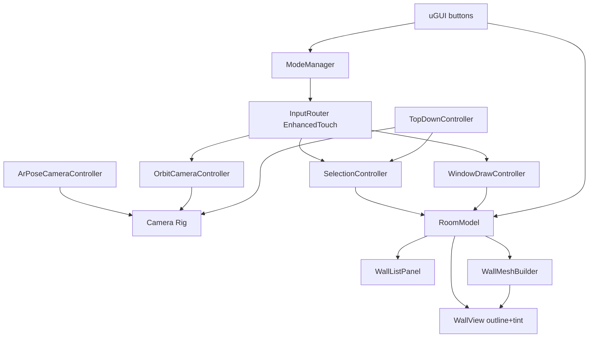

# Technical Document — Room Wall Selection

Consolidated technical reference for the Unity_IOS_mini_task app. Sources of truth: `.specs/features/room-wall-selection/` (spec.md, context.md, design.md) and `.specs/STATE.md`. This document summarizes them for the deliverable.

## 1. Overview

Unity iOS app that renders a synthetic 3D room from a first-person camera. The user orbits by touch drag, taps walls to toggle selection (outline + tint), reads a collapsible real-time wall list, and clears selection via a button or by tapping empty space. Extras in scope: real window holes cut by dragging a rectangle on a wall, an AR mode where the iPhone's pose drives the camera, and an interactive 2D top-down plan.

All product decisions below were made explicitly by the project owner during the spec Q&A (2026-08-17); none were assumed unilaterally. Remaining tuning defaults are logged as assumptions in the spec.

## 2. Locked decisions

| Area | Decision |
| ---- | -------- |
| Room source | Synthetic 3D room (MVP); AR/LiDAR wall detection out of scope |
| Extras in scope | Window holes, AR pose camera, interactive 2D top-down plan |
| Engine / pipeline | Unity 6 (6000.x) + URP |
| Validation target | Unity Editor only (project remains iOS-exportable; no device build required) |
| Camera | First-person inside the room; 360 deg free yaw; pitch clamped (-60..+60 default, tunable); no zoom |
| Selection feedback | Outline + tint together |
| Clear selection | Button AND tap on empty space |
| Wall list | Collapsible panel, real-time updates |
| Room shape | Rectangular 4 walls in scene; generation code generic for N walls |
| Window drawing | Drag two corners on the wall, live preview |
| Window technique | Real procedural mesh cut (see-through) |
| Window rules | Multiple per wall; no overlap; clamped to wall bounds; minimum size (0.2 m x 0.2 m default) |
| Top-down plan | Interactive: tapping walls in the plan toggles selection |
| AR mode | AR Foundation device pose drives the synthetic-room camera; touch input for camera disabled while active |
| Architecture | Light MVC/MVP, plain-C# domain + C# events; no DI framework |
| Input | Input System (new) + EnhancedTouch (touch simulation in Editor) |
| UI | uGUI (Canvas) + TextMeshPro |
| Tests | Unity Test Framework: EditMode (logic) + PlayMode (interaction) |
| Language | Docs, code and UI in English |

## 3. Requirements summary

Priorities: **P1 = MVP**, P2, P3. Full EARS acceptance criteria live in the spec.

- **P1 — Orbit synthetic room** (ROOM-01, CAM-01, CAM-02): N-wall room generation; drag = yaw/pitch orbit; first-person; mouse drag works in Editor.
- **P1 — Tap wall selection** (SEL-01..03): tap toggles; outline + tint; drags never toggle; floor/ceiling taps are no-ops.
- **P1 — Real-time wall list** (LIST-01, LIST-02): collapsible panel; rows update the same frame selection changes, even while collapsed.
- **P1 — Clear selection** (CLR-01, CLR-02): Clear button and empty-space tap deselect all; idempotent when empty.
- **P2 — Window holes** (WIN-01..03): window mode toggle; drag preview projected on wall; on release, real mesh hole; reject overlap/too-small; clamp to bounds; multiple windows per wall.
- **P3 — AR pose camera** (AR-01): AR Foundation pose drives camera; touch camera disabled during AR; smooth handoff back to orbit; toggle disabled where AR unavailable; selection still works.
- **P3 — Top-down plan** (TOP-01, TOP-02): orthographic top view; selected walls tinted; plan taps toggle selection; returns to previous 3D view.

## 4. Architecture

One-way flow: **InputRouter → mode-specific controller → RoomModel (domain) → events → views/UI**.



**Domain layer (plain C#, EditMode-testable, no scene dependency):**

- `RoomModel` — walls, selection set, windows; mutation API + `event Action` notifications; single source of truth.
- `RoomBuilder` — room generation from an ordered footprint polygon (generic N >= 3 walls).
- `WallMeshBuilder` — wall mesh with axis-aligned rectangular holes via grid-slicing decomposition (exact, no CSG dependency); outputs raw vertex/triangle arrays.
- `WindowPlacementValidator` — clamp to bounds, overlap rejection, minimum size.

**Presentation layer (MonoBehaviours):**

- `InputRouter` — single EnhancedTouch entry; tap vs drag classification (20 px DPI-scaled / 300 ms, tunable); uGUI hit gate (`IsPointerOverGameObject`).
- `ModeManager` — explicit state machine `Orbit | WindowDraw | Ar | TopDown` owning input routing.
- `OrbitCameraController`, `ArPoseCameraController` (pose → rig; rotation always, position clamped inside room; yaw/pitch handoff on exit), `TopDownController` (ortho top camera; forwards plan taps).
- `SelectionController` — raycast: wall → toggle; empty → clear; floor/ceiling → no-op.
- `WindowDrawController` — drag start fixes target wall + corner; live clamped preview quad; release → `TryAddWindow`.
- `WallView` — mesh/collider per wall; selection = layer swap to `SelectedWall` + tint via MaterialPropertyBlock; rebuilds on window add.
- `WallListPanel` — collapsible uGUI panel bound to model events.

**Key techniques:**

- **Outline**: URP RenderObjects Renderer Feature over the `SelectedWall` layer (screen-space outline pass) + tint fallback. Chosen over inverted hull, which reads poorly on thin flat prisms.
- **Hole cutting**: holes are axis-aligned rects on a rectangular face, so the face decomposes exactly into rectangles by slicing at hole-edge X/Y coordinates and emitting tiles outside holes. Pure function over arrays → unit-testable.

## 5. Data model

```csharp
struct Rect2D { float x, y, w, h; }              // wall-local meters
class WallDefinition { int id; string name; Vector3 origin, right, up; float width, height; }
class WindowSpec { int wallId; Rect2D rect; }
class MeshData { Vector3[] vertices; int[] triangles; Vector2[] uvs; }
enum WindowRejection { None, Overlap, TooSmall, OutOfBounds, InvalidWall }
enum Mode { Orbit, WindowDraw, Ar, TopDown }
```

## 6. Business rules

1. Selection is a toggle per wall; any number of walls may be selected.
2. A gesture is a tap only if it moves under the threshold and ends under the time limit; otherwise it is a camera/window drag and never changes selection.
3. Taps on UI never reach the 3D scene; taps on floor/ceiling change nothing; taps on empty space clear all.
4. Window rectangles: axis-aligned in wall space; clamped fully inside the wall; rejected if overlapping an existing window or smaller than the minimum size; multiple allowed per wall; a failed mesh rebuild rolls the window back.
5. AR mode owns the camera exclusively; selection stays active; exiting AR restores orbit from the current orientation (no snap).
6. The wall list always reflects model state, including while collapsed.

## 7. Packages

| Package | Version | Purpose |
| ------- | ------- | ------- |
| com.unity.render-pipelines.universal | 17.x (ships with Unity 6) | URP + outline Renderer Feature |
| com.unity.inputsystem | latest verified for 6000.x via Package Manager | EnhancedTouch, Editor touch simulation, InputTestFixture |
| com.unity.xr.arfoundation | 6.x (6.4.3 verified for 6000.4) | Device pose tracking, XR Simulation |
| com.unity.xr.arkit | 6.x (matches AR Foundation) | iOS provider |
| com.unity.ugui (+TMP) | bundled | UI |
| com.unity.test-framework | bundled | EditMode/PlayMode tests |

## 8. Testing strategy

- **EditMode (pure logic)**: RoomModel toggle/clear/idempotency; WindowPlacementValidator (clamp, overlap, min size, out of bounds); WallMeshBuilder (hole count/positions, watertight tiles, degenerate rejection); RoomBuilder for N-wall footprints.
- **PlayMode (interaction)**: tap toggles wall + list row; drag does not toggle; UI tap does not raycast; clear button and empty tap; window drag creates hole, invalid drags rejected; mode transitions.
- Requirement traceability: every AC maps to at least one test; matrix maintained during the Tasks/Execute phases per the spec-driven workflow.

## 9. Roadmap

1. **P1 (MVP)**: room generation → camera orbit → tap selection + feedback → wall list → clear.
2. **P2**: window mode, preview, validation, mesh cutting.
3. **P3**: AR pose camera (XR Simulation validation), interactive top-down plan.

Task breakdown (`tasks.md`) is produced in the Tasks phase after spec/design approval.
