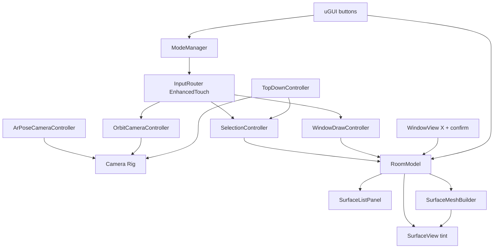

# Technical Document — Room Wall Selection

Consolidated technical reference for the Unity_IOS_mini_task app. Sources of truth: `.specs/features/room-wall-selection/` (spec.md, context.md, design.md) and `.specs/STATE.md`. This document summarizes them for the deliverable. Revised 2026-08-17 per the owner's revision request (single selection, Surface concept, wall thickness, window deletion, 2D/3D view, P0 bootstrap) and the 2026-08-17 adversarial spec review (window-collider tap routing, WindowDraw tap lock, 2D plan usability — AD-014..AD-016).

## 1. Overview

Unity iOS app that renders a synthetic 3D room from a first-person camera. The user orbits by touch drag, taps surfaces (walls, floor, ceiling) to select — exactly one at a time — with tint feedback, reads a collapsible real-time surface list, and clears the selection via the Clear button. Extras in scope: real window holes cut through solid walls by dragging a rectangle (with deletion via X + confirmation), an AR mode where the iPhone's pose drives the camera, and an interactive 2D top-down plan behind "2D | 3D" buttons.

All product decisions below were made explicitly by the project owner during the spec Q&A and the 2026-08-17 revision; none were assumed unilaterally. Remaining tuning defaults are logged as assumptions in the spec.

## 2. Locked decisions

| Area | Decision |
| ---- | -------- |
| Room source | Synthetic 3D room (MVP); AR/LiDAR wall detection out of scope |
| Extras in scope | Window holes + deletion, AR pose camera, interactive 2D top-down plan |
| Engine / pipeline | Unity 6 (6000.x) + URP |
| Validation target | Unity Editor only (project remains iOS-exportable; no device build required) |
| Camera | First-person at room centre, 1.6 m eye height (tunable); 360 deg free yaw; pitch clamped (-60..+60 default, tunable); no zoom in 3D (pinch zoom exists only in the 2D plan); inside-room constraint applies to Orbit mode |
| Selectable surfaces | Walls, floor AND ceiling (`SurfaceKind {Wall, Floor, Ceiling}`) |
| Selection model | SINGLE selection: tapping a surface moves the selection; tapping the selected surface keeps it; Clear button is the only path to empty |
| Selection feedback | P1: tint (MaterialPropertyBlock); P2 polish: stencil two-pass outline |
| Surface list | Collapsible panel, real-time; one selection event carries (previous, current) so both rows update in one call |
| Room shape | Rectangular 4 walls in scene; generation code generic for N walls; surfaces are solid slabs, thickness 0.15 m default (serialized) |
| Window drawing | Window mode button visible only while a Wall is selected AND mode is Orbit → drag two corners, live preview; while in window mode surface taps are swallowed (target wall locked) |
| Window technique | Real procedural mesh cut through the solid wall, including 4 reveal faces per opening; MeshCollider updated in the same operation |
| Window rules | Walls only (never floor/ceiling); multiple per wall; no overlap; min 0.2 m x 0.2 m; max 2.0 m x 2.0 m (tunable); min 0.1 m margin from every wall edge |
| Window deletion | Tap opening collider (identified by `WindowView` component, no dedicated layer; hit never changes selection) → "X" at opening top-right → confirmation popup → remove + rebuild mesh/collider |
| 2D / 3D view | "2D \| 3D" buttons at top; 2D = orthographic top-down framed fit-to-room (+small margin), ceiling renderer AND collider disabled, selection + in-progress draw cancelled; Floor tap within 30 px (tunable) of a wall selects that wall; pinch zoom 0.5x–2.0x (2D only); 3D returns camera to room centre |
| AR mode | AR Foundation device pose drives the synthetic-room camera; touch camera input disabled while active |
| Architecture | Light MVC/MVP, plain-C# domain + C# events; no DI framework |
| Input | Input System (new) + EnhancedTouch (touch simulation in Editor) |
| UI | uGUI (Canvas) + TextMeshPro |
| Tests | Unity Test Framework: EditMode (logic) + PlayMode (interaction) |
| Language | Docs, code and UI in English |

## 3. Requirements summary

Priorities: **P0 = bootstrap**, **P1 = MVP**, P2, P3. Full EARS acceptance criteria live in the spec (24 requirement IDs incl. EDGE-01..06).

- **P0 — Project bootstrap** (BOOT-01): Unity 6 project with URP configured, packages pinned, clean bootstrap scene, Test Runner green with zero tests, iOS build target switch without errors. Assumes Unity MCP; fallback per AD-006 (agent writes text assets, human verifies in Editor).
- **P1 — Orbit synthetic room** (ROOM-01, CAM-01, CAM-02): N-wall room of solid-slab surfaces; drag = yaw/pitch orbit; first-person; camera inside room while in Orbit mode; mouse drag works in Editor.
- **P1 — Single-surface selection** (SEL-01..03): tap moves selection (walls, floor, ceiling); at most one selected; re-tap keeps it; tint feedback; drags never change selection; tap through an opening that hits no surface changes nothing; a hit on a window opening's collider routes to the deletion UI and never changes selection.
- **P1 — Real-time surface list** (LIST-01, LIST-02): collapsible panel listing every surface; (previous, current) rows update the same frame, even while collapsed.
- **P1 — Clear selection** (CLR-01): Clear button only; idempotent when empty (no event); pressed during window mode it cancels the draw, exits the mode and deselects.
- **P2 — Window holes** (WIN-01..03): window mode button only while a Wall is selected AND mode is Orbit; surface taps swallowed while drawing (target wall locked); drag preview; real cut with reveal faces; collider synced; reject overlap/too-small/too-large/margin violation; multiple windows per wall; ray through an opening never hits the wall's surface mesh.
- **P2 — Window deletion** (WIN-04): opening collider → X top-right → confirm popup → remove + rebuild mesh and collider.
- **P2 — Selection outline polish** (OUT-01): stencil two-pass outline; raycast mask includes default + `SelectedSurface` layers.
- **P3 — AR pose camera** (AR-01): AR Foundation pose drives camera (position clamped inside room); touch camera disabled during AR; smooth handoff back to orbit; toggle disabled where AR unavailable; selection still works.
- **P3 — 2D/3D view** (TOP-01, TOP-02): "2D | 3D" buttons; ortho top view framed fit-to-room with ceiling renderer + collider disabled; entering 2D cancels selection and in-progress draw; plan taps move the selection (Floor hit within 30 px of a wall selects the wall — walls are ~0.15 m edge-on and untappable without the assist); pinch zoom 0.5x–2.0x in 2D only; returning to 3D restores the ceiling and places the camera at the room centre.

## 4. Architecture

One-way flow: **InputRouter → mode-specific controller → RoomModel (domain) → events → views/UI**.



**Domain layer (plain C#, EditMode-testable, no scene dependency):**

- `RoomModel` — surfaces, single nullable selection, windows per wall; mutation API (`Select`, `ClearSelection`, `TryAddWindow`, `TryRemoveWindow`) + `SelectionChanged(int? previous, int? current)` / `WindowAdded` / `WindowRemoved` events; single source of truth.
- `RoomBuilder` — room generation from an ordered footprint polygon (generic N >= 3 walls) plus floor and ceiling, all solid slabs.
- `SurfaceMeshBuilder` — solid slab mesh (thickness) with axis-aligned rectangular through-holes: front/back faces via grid-slicing decomposition, outer slab sides, 4 reveal faces per opening; outputs raw vertex/triangle arrays.
- `WindowPlacementValidator` — clamp, overlap, min/max size, edge margin, Wall-kind-only.

**Presentation layer (MonoBehaviours):**

- `InputRouter` — single EnhancedTouch entry; tap vs drag classification (20 px DPI-scaled / 300 ms, tunable); uGUI hit gate (`IsPointerOverGameObject`); primary touch only.
- `ModeManager` — explicit state machine `Orbit | WindowDraw | Ar | TopDown` with a documented transition matrix (Orbit is the hub; TopDown enterable from anywhere and cancels selection + draw; illegal transitions return false).
- `OrbitCameraController` (room centre, 1.6 m eye height serialized), `ArPoseCameraController` (pose → rig; rotation always, position clamped inside room; yaw/pitch handoff on exit), `TopDownController` ("2D | 3D" buttons; fit-to-room ortho framing + pinch zoom 0.5x–2.0x; disables/restores ceiling renderer + collider; camera to room centre on 3D return).
- `SelectionController` — raycast: any surface hit → `Select` (moves selection); miss → unchanged; a hit carrying a `WindowView` component routes to that window's deletion UI, never selection; taps not dispatched while in WindowDraw; in 2D, Floor hit within 30 px of a wall selects the nearest wall; mask includes default + `SelectedSurface` layers.
- `WindowDrawController` — drag start fixes target wall + corner; live clamped preview quad; release → `TryAddWindow`; cancelled by Clear / 2D / mode exit.
- `SurfaceView` — mesh/collider per surface; tint via MaterialPropertyBlock; rebuilds mesh AND MeshCollider in the same operation on window add/remove.
- `WindowView` — per-opening BoxCollider identified by component check at raycast time (no dedicated layer); tap → X button; confirm popup → `TryRemoveWindow`.
- `SurfaceListPanel` — collapsible uGUI panel bound to model events.

**Key techniques:**

- **Selection feedback**: P1 tint via MaterialPropertyBlock. P2 outline via stencil two-pass (mark + edge RenderObjects features) — a RenderObjects layer pass alone does not produce an outline.
- **Hole cutting**: holes are axis-aligned rects on a rectangular face, so each slab face decomposes exactly into rectangles by slicing at hole-edge X/Y coordinates and emitting tiles outside holes; reveal faces connect front and back hole edges. Pure function over arrays → unit-testable.

## 5. Data model

```csharp
enum SurfaceKind { Wall, Floor, Ceiling }
struct Rect2D { float x, y, w, h; }              // surface-local meters
class SurfaceDefinition { int id; string name; SurfaceKind kind; Vector3 origin, right, up; float width, height, thickness; }
class WindowSpec { int id; int surfaceId; Rect2D rect; }
class MeshData { Vector3[] vertices; int[] triangles; Vector2[] uvs; }
enum WindowRejection { None, Overlap, TooSmall, TooLarge, MarginViolation, OutOfBounds, InvalidSurfaceKind }
enum Mode { Orbit, WindowDraw, Ar, TopDown }
```

## 6. Business rules

1. Exactly one surface (wall, floor or ceiling) can be selected at a time; tapping a surface moves the selection there; tapping the selected surface keeps it; the Clear button is the only way to reach the empty state, and clearing an empty selection does nothing (no event).
2. A gesture is a tap only if it moves under the threshold and ends under the time limit; otherwise it is a camera/window drag and never changes selection.
3. Taps on UI never reach the 3D scene; a tap ray through a window opening that hits no surface leaves the selection unchanged; a tap on a window opening's collider opens the deletion UI and never changes the selection.
4. Windows exist only on Wall surfaces: axis-aligned in wall space; clamped inside the wall minus a 0.1 m edge margin; rejected if overlapping, below the minimum size or above the maximum; multiple allowed per wall; a failed mesh rebuild rolls the operation back.
5. Every wall mesh rebuild (window added or removed) updates the MeshCollider in the same operation — a ray through an opening must never hit the wall.
6. Window deletion always goes through the confirmation popup (opening tap → X → confirm).
7. While window mode is active, surface taps never change the selection (target wall locked); the window mode button exists only with a Wall selected in Orbit mode.
8. Entering the 2D view cancels transient state (selection, in-progress window draw), frames the plan fit-to-room and disables the ceiling's renderer and collider; a Floor tap within 30 px of a wall selects that wall; pinch zoom (0.5x–2.0x) exists only in 2D; returning to 3D restores the ceiling and places the camera at the room centre.
9. AR mode owns the camera exclusively; selection stays active; exiting AR restores orbit from the current orientation (no snap).
10. The surface list always reflects model state, including while collapsed.

## 7. Packages

| Package | Version | Purpose |
| ------- | ------- | ------- |
| com.unity.render-pipelines.universal | 17.x (ships with Unity 6) | URP + stencil two-pass outline features (P2) |
| com.unity.inputsystem | latest verified for 6000.x via Package Manager | EnhancedTouch, Editor touch simulation, InputTestFixture |
| com.unity.xr.arfoundation | 6.x (6.4.3 verified for 6000.4) | Device pose tracking, XR Simulation |
| com.unity.xr.arkit | 6.x (matches AR Foundation) | iOS provider |
| com.unity.ugui (+TMP) | bundled | UI |
| com.unity.test-framework | bundled | EditMode/PlayMode tests |

## 8. Testing strategy

- **EditMode (pure logic)**: RoomModel single-selection semantics (move, keep-on-retap, clear idempotency, (previous, current) event payload); WindowPlacementValidator (clamp, overlap, min/max, margin, surface kind); SurfaceMeshBuilder (solid slab topology, hole count/positions, reveal faces, watertight tiles, degenerate rejection); RoomBuilder for N-wall footprints.
- **PlayMode (interaction)**: tap moves selection + updates exactly two list rows; drag does not change selection; UI tap does not raycast; clear button; window mode button visibility per selected surface kind AND mode; taps swallowed while in window mode; window drag creates hole, invalid drags rejected; ray through opening misses the wall's surface mesh (collider sync); window opening tap routes to X (never selection); window deletion flow (X, confirm, cancel); 2D/3D switch (ceiling collider off, state cancelled, camera reset, fit-to-room framing); 2D wall-tap tolerance selects the wall over the floor; pinch zoom clamped to limits in 2D and inert in 3D; mode transition matrix.
- Requirement traceability: every AC maps to at least one test; matrix maintained during the Tasks/Execute phases per the spec-driven workflow.

## 9. Roadmap

1. **P0 (bootstrap)**: Unity 6 + URP project, pinned packages, clean scene, green Test Runner, iOS target switch.
2. **P1 (MVP)**: room generation (solid surfaces) → camera orbit → single-selection + tint → surface list → clear.
3. **P2**: window mode (gated button), preview, validation (min/max/margin/overlap), solid-mesh cutting with reveal faces + collider sync, window deletion, outline polish.
4. **P3**: AR pose camera (XR Simulation validation), 2D/3D view switch.
5. **P4 (open)**: HUD visual pass from the `Room Scanner HUD` art kit (HUD-01) and the window mode button's availability rule. Three tasks, T30-T32, none implemented. Both product questions were settled on 2026-08-18: the button stays on screen and shows state through the disabled palette and its dot instead of disappearing (AD-019, supersedes AD-015), and the app ships landscape with the HUD matching the kit's art (AD-020). P0-P3 are implemented and independently verified — see `validation.md`.

Task breakdown (`tasks.md`) is produced in the Tasks phase after spec/design approval.
